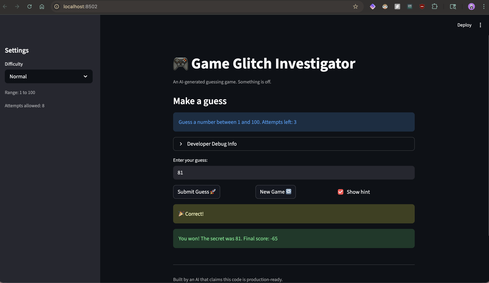

# 🎮 Game Glitch Investigator: The Impossible Guesser

## 🚨 The Situation

You asked an AI to build a simple "Number Guessing Game" using Streamlit.
It wrote the code, ran away, and now the game is unplayable.

- You can't win.
- The hints lie to you.
- The secret number seems to have commitment issues.

## 🛠️ Setup

1. Install dependencies: `pip install -r requirements.txt`
2. Run the broken app: `python -m streamlit run app.py`

## 🕵️‍♂️ Your Mission

1. **Play the game.** Open the "Developer Debug Info" tab in the app to see the secret number. Try to win.
2. **Find the State Bug.** Why does the secret number change every time you click "Submit"? Ask ChatGPT: *"How do I keep a variable from resetting in Streamlit when I click a button?"*
3. **Fix the Logic.** The hints ("Higher/Lower") are wrong. Fix them.
4. **Refactor & Test.** - Move the logic into `logic_utils.py`.
   - Run `pytest` in your terminal.
   - Keep fixing until all tests pass!

## 📝 Document Your Experience

### Purpose

The game generates a secret number and challenges the player to guess it within a limited number of attempts. After each guess the game gives a directional hint ("Go HIGHER" or "Go LOWER") and tracks a running score that rewards winning quickly. Three difficulty settings (Easy, Normal, Hard) change the number range and the attempt limit.

### Bugs Found

| # | Where | What was wrong |
|---|---|---|
| 1 | `check_guess` in `logic_utils.py` | Hint messages were inverted — guessing too high told the player to go *higher*, and guessing too low told them to go *lower*, making the game unwinnable by following the hints. |
| 2 | `app.py` (submit handler) | On every even-numbered attempt the secret was cast to a string before comparison. Python's string ordering (`"9" > "10"`) differs from numeric ordering, so hints were silently wrong on alternating turns. |
| 3 | `get_range_for_difficulty` in `logic_utils.py` | Hard mode returned the range 1–50, which is *narrower* than Normal's 1–100, making Hard the easiest difficulty instead of the hardest. |
| 4 | `app.py` (new game handler) | Clicking "New Game" reset the secret and attempt count but never reset `st.session_state.status`. After winning or losing, `status` stayed `"won"` / `"lost"` and `st.stop()` fired immediately, locking the player out of every new game. |

### Fixes Applied

**Bug 1 — Inverted hints (`logic_utils.py` · `check_guess`)**
Swapped the two return messages so that `guess > secret` returns `"📉 Go LOWER!"` and `guess < secret` returns `"📈 Go HIGHER!"`. Verified with `pytest` (`test_too_high_hint_says_lower`, `test_too_low_hint_says_higher`) and by manually submitting out-of-range guesses in the live app.

**Bug 3 — Hard difficulty range (`logic_utils.py` · `get_range_for_difficulty`)**
Changed Hard to return `1, 500` so the difficulty ordering is Easy (1–20) < Normal (1–100) < Hard (1–500). Verified with `pytest` (`test_hard_range_wider_than_normal`) and by checking the sidebar "Range:" caption after switching to Hard.

**Refactor — logic separated from UI**
All four game logic functions were moved from `app.py` into `logic_utils.py`. `app.py` now only handles Streamlit rendering and imports the functions via a single line. This made the functions unit-testable without needing a running Streamlit server.

## 📸 Demo

- 

## 🚀 Stretch Features

- [ ] [If you choose to complete Challenge 4, insert a screenshot of your Enhanced Game UI here]
